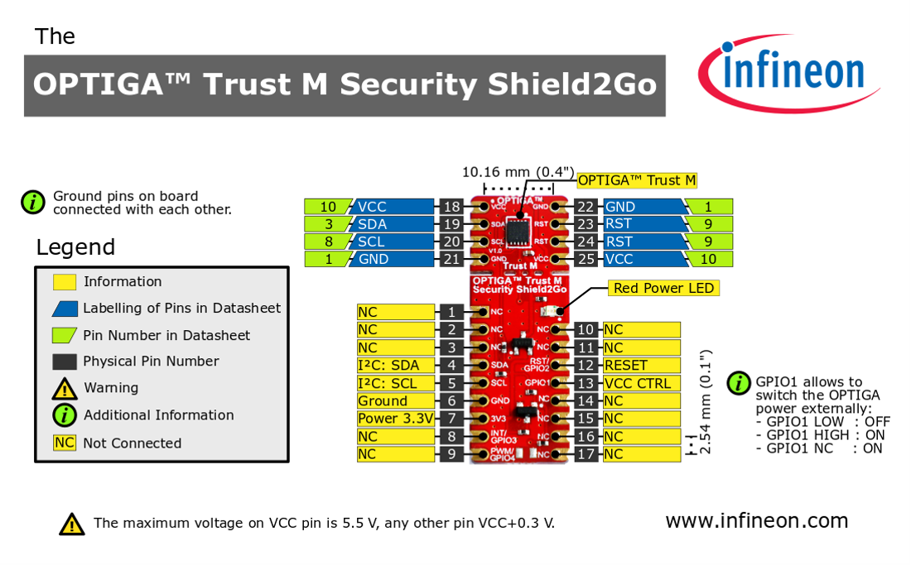

<!--
SPDX-FileCopyrightText: 2024 Infineon Technologies AG

SPDX-License-Identifier: MIT
-->

# Quick navigation

- [Quick navigation](#quick-navigation)
- [OPTIGA™ Trust M Zephyr Application](#optiga-trust-m-zephyr-application)
  - [Project structure](#project-structure)
- [Prerequisite](#prerequisite)
  - [Software Setup](#software-setup)
    - [Windows Subsystem for Linux](#windows-subsystem-for-linux)
    - [Zephyr](#zephyr)
    - [usbipd](#usbipd)
    - [Serial Monitor (optional)](#serial-monitor-optional)
  - [Hardware Setup](#hardware-setup)
- [Installing and building Zephyr application](#installing-and-building-zephyr-application)
  - [Installation instructions](#installation-instructions)
  - [Building and Flashing](#building-and-flashing)
    - [Activate the environment](#activate-the-environment)
    - [Building for NXP LPCXPRESSO55S69 board](#building-for-nxp-lpcxpresso55s69-board)
    - [Building for Infineon XMC4700 board](#building-for-infineon-xmc4700-board)
    - [Flashing the board](#flashing-the-board)
    - [Code analysis](#code-analysis)
- [Board specific setup](#board-specific-setup)
  - [Porting/Custom Device Tree Overlay](#portingcustom-device-tree-overlay)
  - [SEGGER JLink Tools](#segger-jlink-tools)
  - [Update debug probe (for NXP LPCXPRESSO55S69 board)](#update-debug-probe-for-nxp-lpcxpresso55s69-board)

# OPTIGA™ Trust M Zephyr Application

Sample application to demonstrate the PAL implementation to use the OPTIGA™ Trust M Host Library for C with Zephyr RTOS.

The project also includes workspace configuration for VSCode and a Makefile to build the OPTIGA™ Library together with Zephyr.

## Project structure
The project configuration assumes the following directory structure to allow the application to be an independent repository.
This allows easier versioning of the application (without forking Zephyr) and a single Zephyr instance to be used by multiple applications.

> **WARNING**
This application uses Zephyr as an SDK to run on device. we recommand building the freestanding application with WSL as described below (or with native Linux) to reduce issues with the build system.

```
Project root
|__ optiga-trust-m-zephyr   (= this repository)
|__ optiga-trust-m          (= OPTIGA™ Trust M Host Library for C)
|   |__ extras/pal
|       |__zephyr           (= Zephyr compatible PAL)
|__ zephyrproject
    |__ .west               (= west build workspace)
    |__ .venv               (= Python virtual environment for build toolchain)
```

# Prerequisite

## Software Setup

### Windows Subsystem for Linux
Install WSL, VS Code and the WSL Extension [as described here.](https://code.visualstudio.com/docs/remote/wsl)
Alternatively, the setup can also be performed inside a Virtual Machine or a native Linux installation and a different IDE can be selected. This instruction only covers the usage of WSL and VS Code.

### Zephyr
Follow the [Zephyr Getting Started Guide](https://docs.zephyrproject.org/latest/develop/getting_started/index.html) to install the development environment in **WSL** (use the instructions for Ubuntu).
It is recommended to add another directory layer when initializing the environment (e.g. ```~/ProjectRoot/zephyrproject```). This allows cleaner bundling of Zephyr with the OPTIGA™ files.

### usbipd
Flashing and debugging requires access to the hardware from within WSL. [Follow the instructions](https://learn.microsoft.com/en-us/windows/wsl/connect-usb) to install and use usbipd.

This tool uses the virtual network adapter, which might be blocked by the firewall, to forward data. Use the following command in PowerShell to disable the firewall for this adapter if the device cannot be found from within WSL:

```
Set-NetFirewallProfile -DisabledInterfaceAliases "vEthernet (WSL)"
```


### Serial Monitor (optional)
The *Serial Monitor* plugin is used to connect to the Virtual COM port of the J-Link debugger and display the logger output.
It is configured to use the serial ports of the WSL in the workspace configuration, but the permissions need to be changed to allow VS-Code to open the ports:

WSL does not assign the correct group and mode to the serial ports. Add the following to ```/etc/wsl.conf```:
```
[boot]
systemd=true
```

The WSL user needs to be added to the *dialout* group:
```
sudo usermod -a -G dialout $USER
```
Close VS-Code and shutdown WSL from PowerShell (```wsl --shutdown```), it should be possible to open ```/dev/ttyACMO``` in the Serial Monitor tab after restarting WSL, VS-Code and attaching the device in usbipd.

## Hardware Setup
This example application uses Device Tree Overlays from Zephyr to set the pin configuration of the target boards. The default configuration (`app.overlay`) works for all target boards supporting the Arduino Connector. 

You can connect any one of the OPTIGA™ Trust M Shields ([see here for a full list](https://github.com/Infineon/optiga-trust-m-overview?tab=readme-ov-file#evaluation-and-development-kits)) with either the [OPTIGA™ Trust Adapter](https://www.infineon.com/cms/en/product/evaluation-boards/optiga-trust-adapter) or the [Shield2Go Adapter for Arduino](https://community.infineon.com/t5/Projects/MyIoT-Adapter-Shield2Go-Adapter-for-Arduino/ba-p/436122). 

It is also possible to connect one of the OPTIGA™ Trust M Shields manually to the Arduino connector using the following Pin Layout:

| OPTIGA™ Trust M Pin | Arduino Connector |
|:-------------:|:-----------------:|
| RESET         | D4                |
| VCC_CTRL      | D7                |
| SDA           | D14               |
| SCL           | D15               |

> **WARNING**
*OPTIGA™ Trust M* should not be directly powered from a GPIO of the host MCU, as it might not deliver enough current for stable operation. Connect the 3.3V pin to a stable supply and use the *VCC_CTRL* pin to switch the power.




# Installing and building Zephyr application

## Installation instructions
A script for automated setup of the environment is provided, see the [Installation instructions](docs/INSTALL.md).

## Building and Flashing

### Activate the environment
The environment needs to be activated every time a new terminal is opened:
```
optiga-trust-m-zephyr:> source ../zephyrproject/.venv/bin/activate
optiga-trust-m-zephyr:> source ../zephyrproject/zephyr/zephyr-env.sh
```

The *West* build tool is used to build the application for a specific board and flash it:

### Building for NXP LPCXPRESSO55S69 board
```
(venv) optiga-trust-m-zephyr:> west build -p -b lpcxpresso55s69_cpu0
```

### Building for Infineon XMC4700 board
```
(venv) optiga-trust-m-zephyr:> west build -p -b xmc47_relax_kit
```

### Flashing the board
```
(venv) optiga-trust-m-zephyr:> west flash
```

### Code analysis
Many tools for static code analysis can be used with  a compilation database (`compile_commands.json`), which is generated by building the project with Clang:

```
export ZEPHYR_TOOLCHAIN_VARIANT=llvm
west build -p -b native_sim -- -DCMAKE_EXPORT_COMPILE_COMMANDS=ON
```

```
clang-tidy -p build/compile_commands.json --config-file=.clang-tidy ../optiga-trust-m/pal/zephyr/*.c src/main.c
clang-format -style=file -i ../optiga-trust-m/pal/zephyr/*.c src/main.c
```

# Board specific setup
## Porting/Custom Device Tree Overlay
If the target platform does not provide the Arduino connector (or a different pin configuration is required), custom Device Tree Overlays can be provided in the *`boards`* directory. The build system will select the board-specific overlay file instead of the default overlay.

if the board used is not available under *`boards`* directory. we recommand the steps below :

1- Check if the board is supported by Zephyr [supported devices](https://docs.zephyrproject.org/latest/boards/index.html#supported-boards).

2- Look for the ".dts"´file of your board under Zephyr/boards/\<board_provider>/\<board_name>/\<file>.dts

3- The file includes the devicetree configuration.

> For more information, please refer to the official documentation on [devicetree](https://docs.zephyrproject.org/latest/build/dts/index.html#devicetree-guide).

## SEGGER JLink Tools
Most evaluation boards include a JLink debugger hardware. Download and install the [JLink Tools](https://www.segger.com/downloads/jlink/JLink_Linux_V794b_x86_64.deb) in WSL.

## Update debug probe (for NXP LPCXPRESSO55S69 board)
The on-board debugger of the LPC board does not provide all features out-of-the-box, the firmware needs to be updated to enable them.
* Download and install [LPCScrypt](https://www.nxp.com/lpcscrypt) on Windows
* Set the **DFU** jumper on the LPC board and connect the *Debug Link* USB to the computer
* Run the ``program_JLINK.cmd`` script, disconnect the board and **remove the DFU jumper**
